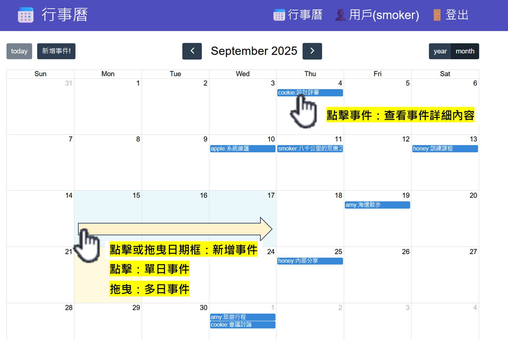
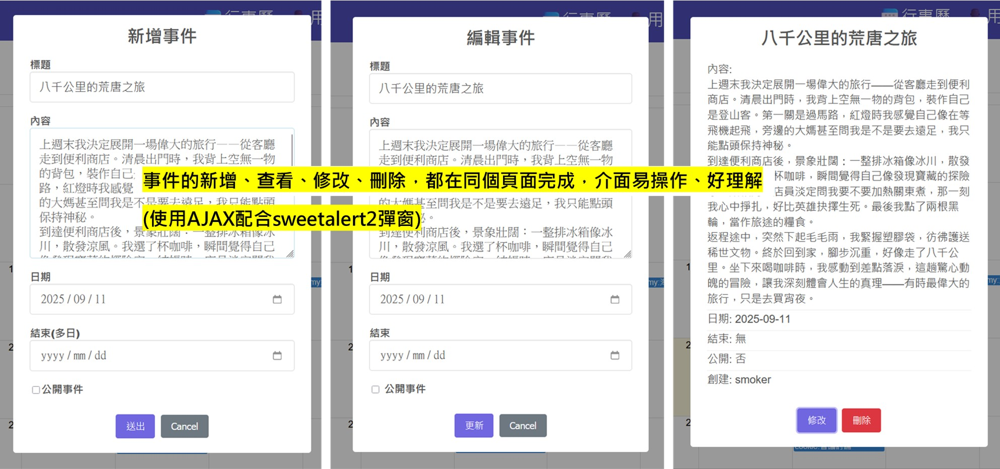
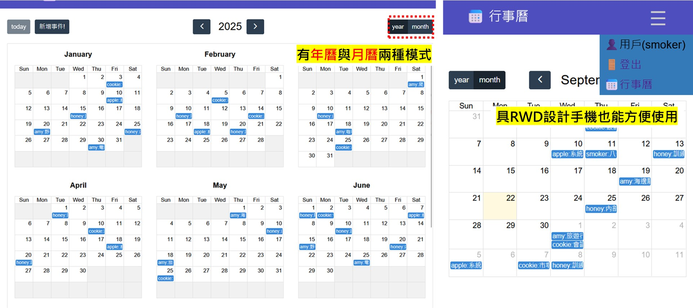

# calendar

## 簡介

這是一款簡單易用的行事曆應用：

- 前端使用 FullCalendar 顯示行事曆
- SweetAlert2 提供互動式彈窗
- 支援新增、編輯、刪除事件
- 年曆 / 月曆切換，RWD 支援手機操作







## 使用到的框架與套件

| 類型 | 框架與套件 |
|------|------|
| 後端框架 | Flask |
| ORM / 資料庫 | SQLAlchemy |
| 資料驗證 / 序列化 | Marshmallow |
| 前端 (行事曆展示) | FullCalendar |
| 前端 (互動 / 提示) | SweetAlert2 |

## 如何使用

```bash
git clone https://github.com/smoker878/calender.git
cd calender

# 建立虛擬環境
python -m venv venv
source venv/bin/activate   # Windows: venv\Scripts\activate

# 安裝套件
pip install -r requirements.txt

# 設定環境變數
cp .env.example .env
# 編輯 .env，設定 SECRET_KEY 與 DATABASE_URL

# 建立資料庫
flask db init        # 初始化 migrations 資料夾
flask db migrate     # 建立遷移檔
flask db upgrade     # 套用到資料庫

# 啟動
flask run
```

## 行事曆事件API(RESTful)

| 路由             | 方法     | 說明     | 備註         |
| -------------- | ------ | ------ | ---------- |
| `/events`      | GET    | 取得事件列表 | 未登入：公開事件<br>登入後：自己與公開的事件 |
| `/events`      | POST   | 新增事件   | 需登入        |
| `/events/<id>` | PUT    | 更新事件   | 僅可修改自己的事件  |
| `/events/<id>` | DELETE | 刪除事件   | 僅可刪除自己的事件  |
